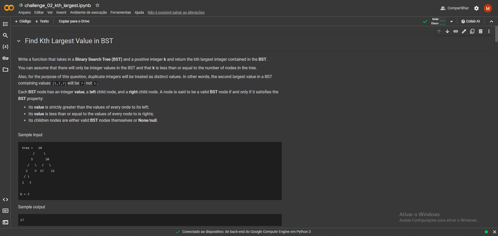
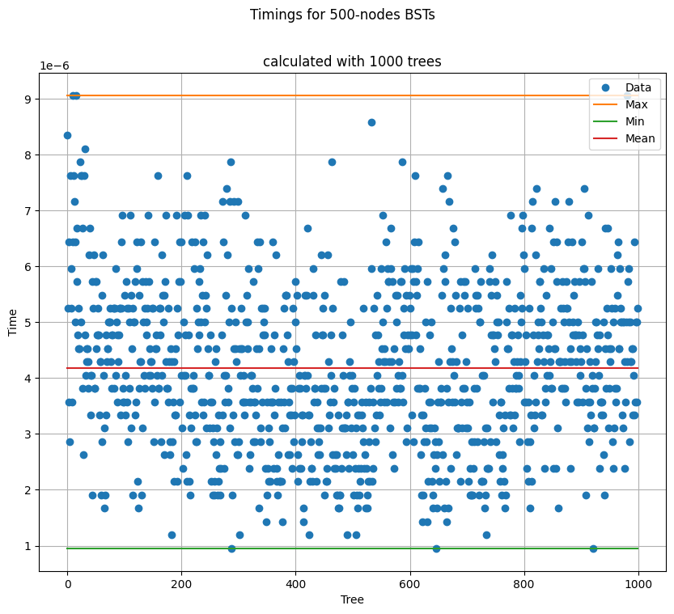
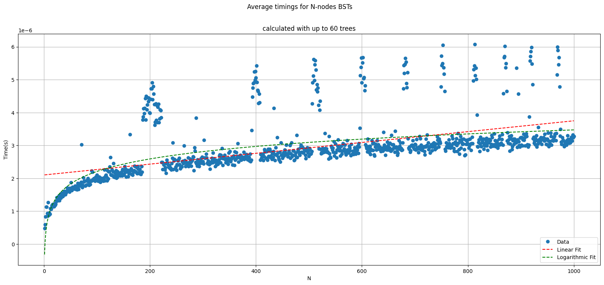

> [!NOTE] 
> **Attention**  
> This document is written in Github-flavoured Markdown and was meant to be read either from the Github Markdown preview or from a compatible Markdown reader.

> [!NOTE] 
> **Attention (again)**  
> This resolution was made with the help of AI. You can check the whole session with ChatGPT 3.5 in [this link](https://chat.openai.com/share/6c634d3d-67e0-4ce5-8c7d-bfa3c3b875bc).

Estudante: Marcos Vinícius Bandeira Irigoyen

Resolution of task 3 from the [Algorithms and Data Structures II course](https://github.com/ivanovitchm/datastructure) at UFRN. More context about it shall be available at the professor's repository wheter he chooses to.

[Presentation video]() (It's in portuguese and not really good)

Notebook links:
- [Find Closest Value in BST](https://drive.google.com/file/d/1MF8c_QR90kHAJzwxiN1TomKCQy_2zi3W/view?usp=sharing);
- [Find Kth Largest Value in BST](https://drive.google.com/file/d/1oNGdhOEtJbM7wgNaVwUGq7mvh1HzjfwO/view?usp=sharing).

## Folder Structure
- Images used within this document are on the `images/` subfolder;
- The notebooks are the files that end on `.ipynb`;
- The very text you're reading comes from the `readme.md` file.

## Execution
You can open any of the notebooks using either Google Colab or a Jupyter Notebook. If you don't already have Jupyter Notebook or any previous python experience I heavily suggest you to use Google Colab.  
The packages used directly on the notebooks are `plotly`, `pytest`, and `matplotlib`. Be sure to have them set up on your environment beforehand (Google Colab will already have all of them). 

You might find [this tutorial video](https://youtu.be/RLYoEyIHL6A) more direct/approachable for the Google Colaboratory usage than the step-by-step guide.

The following step-by-step guide refers to how to execute it on Google Colab (shorthand for [Google Colaboratory](https://colab.research.google.com/)):

1. Prerequisites:
    - A google account;
    - A web browser;
    - Internet access.
1. Steps:
   1. Access the link of the notebook you want to execute (it's right above the `Folder Structure` section in this document);
   2. If you're not logged in, first click on the login button (if you are, skip to step 3).
      1. Do your login. It will need your email/phone and password (FROM YOUR GOOGLE ACCOUNT). Be sure that it is the proper webpage for login too;
      2. You might need access to your phone/the phone of those responsible for you to access it;
      3. If you're unsure about logging in or having difficulties with it, i heavily encourage you to ask the help of someone you know that can be more knowledgeable about computers in general.
   3. After logged you should be back to the notebook file page. Click on the button "Open with Google Colaboratory" and a new tab shall be open for it.
      1. If there's no button like that, you will probably need to add Colaboratory into the connected apps. Be sure that [this app](https://workspace.google.com/u/0/marketplace/app/colaboratory/1014160490159) is installed (and that it is in fact the proper Colaboratory app).
   4. Change to this new tab. It is the notebook open on the platform.
   5. From here, you can either see the results saved from my latest execution or run the notebook itself. If you are okay with seeing the results from my run, jump to step `9`, if not, follow along.
   6. Read the whole code, be sure that it can't be harmful for you or anything that you have (for i am but a stranger to you who reads this). If you're sure it is safe, i suggest you to access the `Runtime` tab and click on the `Run all` button (it can also be done with the `Ctrl`+`F9` shortcut).
   7. There shall appear a warning popup that the notebook isn't authored by Google (whom i've never and probably won't ever claim to be). If you've followed step 6 and are sure the code is safe you might click on `Execute anyway`.
   8. Wait for every cell to be executed. A specific cell on the first notebook might take a bunch of time, be sure to have read the code comments in this cell.
   9. Voila! It should all be executed and ready for visualization. Congratulations on following along this step-by-step guide.
3. Expected result:
    - A screen similar to the following should be appearing for you (the image was taken in a computer in Portuguese, running Google Chrome on a unactivated Windows, logged into one of my accounts (Don't worry if your account image is similar to mine, i'm not using yours'))
    

## Resolution overview

### Find Closest Value
Function code for quick reference:
```python
def findClosestValue(tree:BST, target):
    """
    Finds the value in a binary search tree that is closest to the given target value.

    This function begins the search for the closest value from the root of the binary search tree.
    It works by sequentialy exploring the tree, narrowing down the search based on the target value
    and the current node's value. The closest value is constantly updated throughout the search process.
    If it ever findd the target in the tree, it will be returned immediately.

    Parameters:
    tree (BinarySearchTree): The binary search tree object in which to find the closest value.
                             It is expected to have a 'root' attribute that points to the root node of the tree.
                             If it doesn't, an ValueError exception will be thrown.
    target (int): The target value for which the closest value in the binary search tree is sought.

    Returns:
    int: The value in the binary search tree that is closest to the target value.
    """

    if (tree.root == None):
        raise ValueError("Empty tree!")

    actualNode = tree.root
    diff = actualNode.value - target
    error = abs(diff)
    winner = actualNode.value

    #if we find the target value we can already stop
    while(error!=0):

      if diff > 0:
        actualNode = actualNode.left_child
      else:
        actualNode = actualNode.right_child

      if actualNode is None: break;

      diff = actualNode.value - target
      error = abs(diff)
      if error < abs(winner-target):
        winner = actualNode.value

    return winner
```
The solution created goes through the tree iteractively to avoid the memory overhead of recursive calls while using the properties of the binary tree node disposition to avoid checking nodes that would necessarily increase the difference between the target value and the actual node's one. We do some error handling for calls with empty trees and an early stop if we do find the target value within the tree (for there can't be any absolute error lesser than 0).

### Find K-th largest Value
Function code for quick reference:
```python
def findKthLargestValue(tree, k):
    """
    Finds the kth largest integer in a Binary Search Tree (BST).

    The function traverses the BST in an in-order manner accessing the nodes
    from highest to lowest. When the function access the kth-largest node, it's
    value is returned.
    In case of duplicate integers, they are treated as distinct values.
    The kth largest integer is determined in the context of these distinct values.

    Parameters:
    tree (BST): the Binary Search Tree (BST).
    k (int): A positive integer representing the kth position.

    Returns:
    int: The kth largest integer present in the BST.
    """

    if k <= 0:
      raise ValueError("k can't be less or equal to 0.")
    i = 1
    res = None
    #this function will, instead of returning a value, just change the higher-
    #-scope `res` value
    #we declare it inside the function to try to reduce the stack frame
    def traverse(node:Node):
      nonlocal i, res
      if not (node.right_child is None): traverse(node.right_child)
      if i == k: res = node.value
      i += 1
      if i > k: return
      if not (node.left_child is None): traverse(node.left_child)

    traverse(tree.root)

    if res is None: raise ValueError(f"The tree has only {i-1} values")

    return res
```

This solution goes through the BST in a in-order kind of order (doing right -> action -> left) checking if the counter variable `i` is equal to `k`, incrementing the counter variable after and, if `i` is greater than `k`, leaving earlier the function. ´i´ represents which N-th largest value we are looking at the moment, this makes us avoid the need to store a list of every accessed node's value (which would change the worst case space complexity). Letting both `i` and `res` 'outside' of the recursive function simplified the parameter passing logic, personally, and the stack frame size of the function call.

P.S.: This function lacks error handling for empty trees, sorry.

## Results

The results here can also be seen on the "Computational Complexity Analysis" section from each notebook.

### Find Closest Value

#### Time Complexity

Analysing how many times each part of the function's body will be executed, we
would come to something like the following:
```python
def findClosestValue(tree:BST, target):
  if (tree.root == None):                             #1
          raise ValueError("Empty tree!")             #1
  
      actualNode = tree.root                          #1
      diff = actualNode.value - target                #1
      error = abs(diff)                               #1
      winner = actualNode.value                       #1
  
      #if we find the target value we can already stop
      while(error!=0):                                #X
        
        if diff > 0:                                  #X
          actualNode = actualNode.left_child          #X
        else:                                         #X
          actualNode = actualNode.right_child         #X
        
        if actualNode is None: break;                 #X
  
        diff = actualNode.value - target              #X
        error = abs(diff)                             #X
        if error < abs(winner-target):                #X
          winner = actualNode.value                   #X
  
      return winner                                   #1
```

Where X, as the order of searches, isn't trivially defined. We can consider, as
we only search in one of a node's branches, that the worst case will be proportional to the height of the tree. For a completely unbalanced tree (e.g, a BST that added numbers in a ascending/descending order) it would be it's height — O(N), while for a balanced tree it would be O(log(N)).

Plots:




#### Space Complexity

Simply counting the variables we can see that we only keep `actualNode`, `diff`,
`error` and `winner` at all times (after their initial usage, of course), independently of the number of nodes in the tree. That would give us a O(1) space complexity for any type of tree.

> **Hint 3**
>
>What are the advantages and disadvantages of solving this problem iteratively as opposed to recursively?

Here is where i think Hint 3 was destined to. In a recursive function, without assuming that it is tail-recursive and that Python can do a Tail Call optimization$^1$ (which it can't anyways, but could be implemented$^2$), there would be a new stack frame for every recursive call, making it the same order as the time complexity.

Interesting links for the number signalled parts:
1. [Tail Recursion Explained - Computerphile](https://www.youtube.com/watch?v=_JtPhF8MshA)
2. [Python is the Haskell You Never Knew You Had: Tail Call Optimization](https://sagnibak.github.io/blog/python-is-haskell-tail-recursion/)

### Find Kth Largest Value in BST

There won't be any plot in this algorithm 'cause it's complexity is intended to be explained in the video. There are english subtitles innit to aid those who doesn't understand Portuguese.

#### Time Complexity

Analysing firstly the body of the function to see how many times each section would be executed:
```python
def findKthLargestValue(tree, k):
    if k <= 0:                                                          #1
      raise ValueError("k can't be less or equal to 0.")                #1
    i = 1                                                               #1
    res = None                                                          #1

    def traverse(node:Node):                                            #1 (considering
                                                                        # only the function
      nonlocal i, res                                                   # declaration instead
      if not (node.right_child is None): traverse(node.right_child)     # of it's execution,
      if i == k: res = node.value                                       # it's timing will be
      i += 1                                                            # analyzed when it
      if i > k: return                                                  # gets called.
      if not (node.left_child is None): traverse(node.left_child)

    traverse(tree.root)                                                 #X

    if res is None: raise ValueError(f"The tree has only {i-1} values") #1

    return res                                                          #1
```
Where to define X we need to look at how the `traverse` function will operate in a tree. Due to order of access in the three (going right -> action -> left) we will first go through the right-most branch of the three, already rendering us a `h` factor to the worst case (`h` being the height of the tree). After reaching the right-most leaf, the function will proceed to execute another `k` times, as the first executed 'action' on the node will refer to the largest value, the second to the 2nd largest and so on. Combining both we get a O(h+k) time complexity, as expected.

#### Space Complexity
We will have `i` and `res` in any given moment of the function (after their initialization) and we will store in the stack frame for the recursion of `traverse` at maximum the height of the tree as references to it's nodes. It happens because we are never able to call the function in both sides of the node without having resolved first the right side call, so we have only the direct path between the root and the active node on the stack, which for the leaf node that gives the BST's height, gives us the O(h) space complexity.

Do note that if we had kept a list with all values (or up to `k` values, whichever is the lowest) in descending order, we would have something proportional to the time complexity, for every call would have it's initial `h` impact on the stack and then the factor refering to the `k` values on the list.