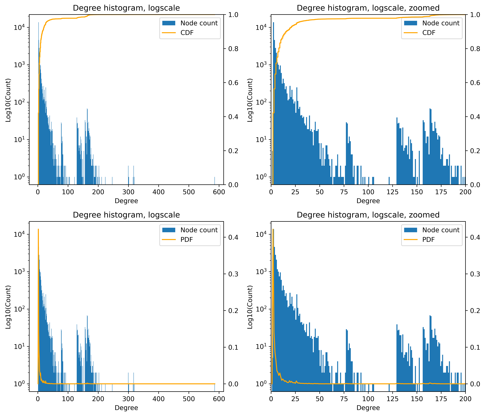
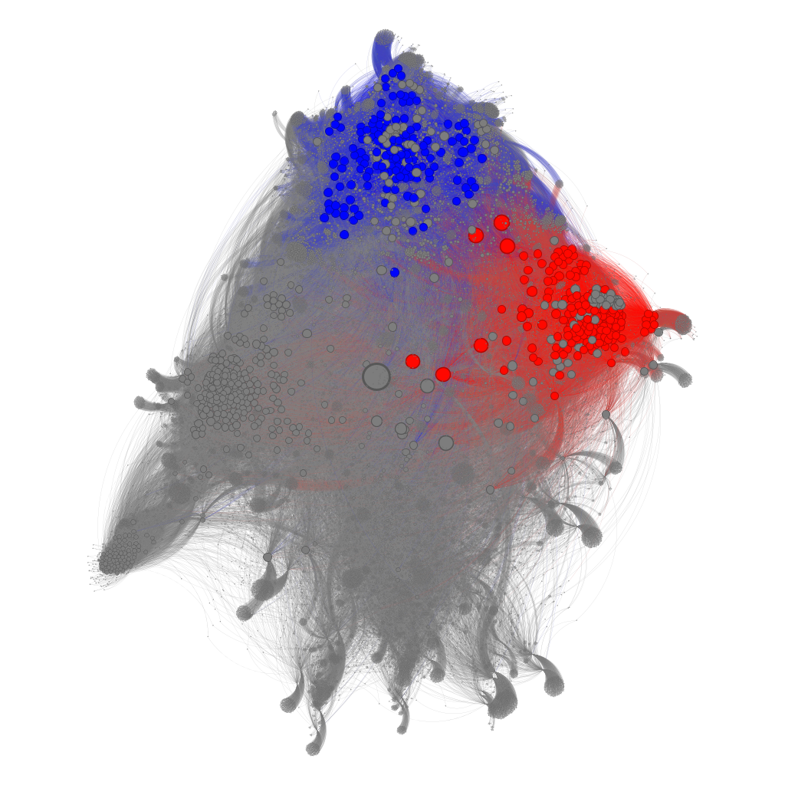
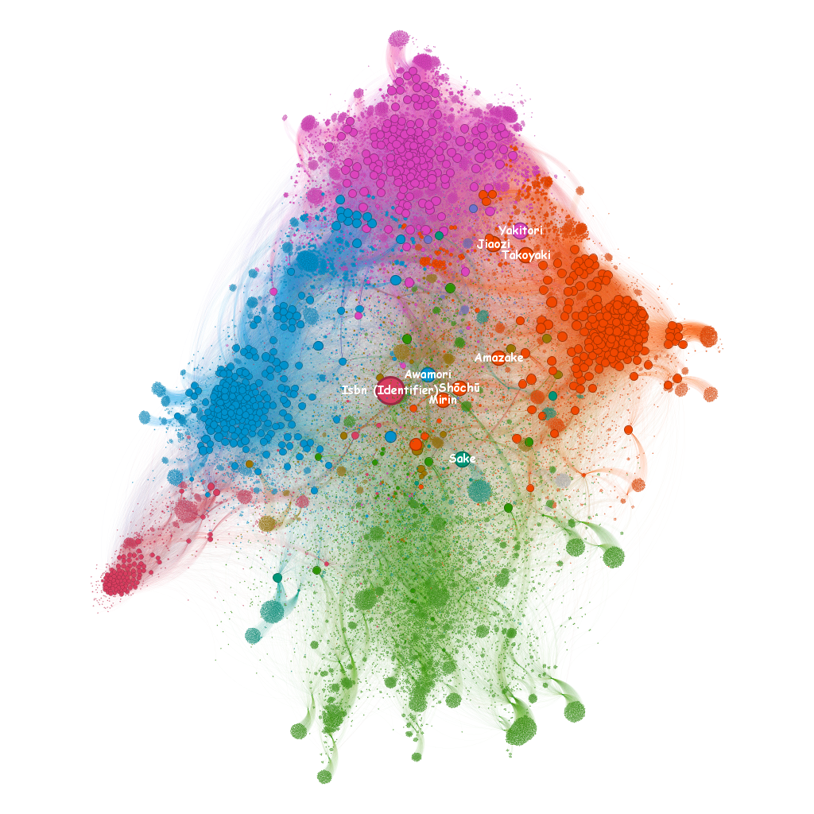

# Análise de rede — Rede de páginas formada por itens gastronômicos do Brasil, França e Japão

## Sobre o tema
A priori a escolha do tema era sobre as culinárias de nações com pouca relação histórica entre si, como a culinária mexicana, a sueca e a coreana. Entretanto, por fatores computacionais decorridos do tamanho da rede de _Mexican Cuisine_, foi decidido pivotar para itens gastronômicos de diferentes culturas.

Ainda sobre os itens escolhidos, houve uma diferença considerável entre o tamanho das redes — o pretzel, de países europeus e, em sua maioria, germânicos, teve aproximadamente o dobro de nós em comparação à brasileira (ou em alguma versões, portuguesa) caipirinha, que por sua vez foi pouco maior que o _Chahan_ (ou Yakimeshi, caso tenha comido em uma certa rede de restaurantes caracterizada por servir comida chinesa em caixas). As três tem tamanhos de cerca de 72, 36 e 28 mil respectivamente. Fica em questão o quanto isso se dá pela diferente abrangência de cada item e o quanto é pela representatividade de diferentes culturas dentro da wikipedia em inglês.

## Métricas de centralidade (requisito 2)

Esta imagem trás os mapas de calor de algumas medidas de centralidade calculadas na rede, sendo elas devidamente normalizadas à mesma escala e coloridas de acordo com o valor das medidas nos nós. Enquanto que todas as medidas buscam esta mesma ideia de nós mais "centrais" ou importantes à rede, podemos inferir diferentes pontos (e com diferentes eficácias) a partir deles.

A _degree centrality_ permite uma análise quantitativa da importância dos nós, mas para esta modelagem ainda deixa escapar a diferenciação entre o grau de entrada e grau de saída — a principal razão de se ter o grafo direcionado. — Com isso, o grau de saída acaba ofuscando o grau de entrada. Medidas como o HITS conseguiriam diferenciar entre um alto grau de entrada (_authority_) e um alto grau de saída (_hub_), mas lidariam com outro problema: as caixas de navegação. Ao fim da página de um determinado assunto, pode haver a presença de uma caixa de navegação com categorias nas quais o assunto se encaixe, abrangendo extensivamente todos os demais artigos das categorias. Isso afeta ambos os graus, mas por conta da distância máxima às páginas iniciais que foi selecionada, acabou impactando muitíssimo mais o grau de saída.

À exemplo disso, podemos considerar os pratos [Biryani](https://en.wikipedia.org/wiki/Biryani), [Tamale](https://en.wikipedia.org/wiki/Tamale) e [Yakitori](https://en.wikipedia.org/wiki/Yakitori). Os dois primeiros são os dois maiores graus em geral (2049 e 1650), enquanto que Yakitori é o segundo maior grau de entrada (319). Os três são categorizados como _Street food_, a qual a página inicial do Pretzel pertence. Cada um deles, que são vizinhos de nível 1 do Pretzel, vai criar uma conexão a partir deles para todos os demais _Street food_ e todas as outras categorias a qual pertencem. Essas demais categorias, por sua vez, não poderão estabelecer a conexão de volta por já serem vizinhos de nível 2. O Yakitori em específico também encaixa na categoria de comidas e bebidas japonesas, à qual o Chahan pertence, fazendo com que os vizinhos de grau 1 dessas duas categorias se referenciem a ele, independentemente de qualquer importância que possam ter à rede. Por final, erros na filtragem de listagens de itens e de _stop words_ também criaram outros _outliers_.

OBS.: Um ponto positivo a este efeito colateral é que se pode detectar esses agrupamentos através do mapa de calor.

A _closeness centrality_, refletora da distância média de um nó aos demais, consegue detectar melhor a qualidade das conexões dos nós para este caso. Sua vizualização, entretanto, é mais dificultada devido a valores extremos. Dos dez maiores valores de centralidade, sete são identificadores, com o ISBN, de maior centralidade (0.0201), tendo uma diferença equivalente a 35% da escala com o 2o maior, o Doi (0.0153). Ignorando os identificadores, temos saquê (0.0141), mirin (0.0134), e shochu (0.0134) como os três nós de maior _closeness centrality_. Os três são bebidas alcóolicas japonesas, indicando relação tanto à caipirinha quanto ao chahan.

Pela _betweenness centrality_ temos uma outra avaliação levando em conta os caminhos dos nós, mas com uma particularidade que consegue tratar dos problemas dos identificadores: para um dado nó são contabilizados somente os caminhos em que ele está no meio, isto é, sem ser origem ou final do caminho. Com isso os identificadores, que ainda que sejam adicionados, não criam conexões, tem valor nulo. Um colateral, entretanto, é que nós que não sejam as páginas iniciais ou vizinhos de nível 1 de alguma subrede também são anulados. Pela própria formação da rede estes nós já seriam periféricos, de qualquer forma.

Ainda neste critério, temos uma visão bem mais coerente nos termos de maior valor: países e alguns pratos figuram entre os maiores valores. As páginas iniciais, bem como as vizinhas em comum delas, acabam chegando aos valores mais altos pela natureza de formação do grafo: todas os vizinhos de categoria, por serem de nível 1, reconectam-se às páginas iniciais, trazendo um efeito oposto ao dos termos 'filtrados'.

Infelizmente, para visualização do mapa, a distribuição da medida acaba dificultando muitíssimo a visualização do mapa: a diferença dos valores entre Pretzel e Alemanhã, os dois maiores nós, corresponde a 50% da escala — restando a metade inferior do intervalo de cores para os demais pontos. Isso, junto ao fato da maioria dos nós serem vizinhos de nível 2 (mesmo depois de truncados), torna-o o pior mapa a se visualizar da imagem.

Por fim, na _eigenvector centrality_ temos a melhor visualização e resultados condizentes com a análise do k-core do requisito 4. Os nós mais bem centralizados são, normalmente, comidas japonesas de rua e seus ingredientes. Pelas categorias, são vizinhas diretas do pretzel e do chahan, enquanto que se conectam a caipirinha através de nós como saquê. Um outlier pode ser encontrado no Isbn, que por seu altíssimo in-degree acaba obtendo um valor alto. Pela natureza do algoritmo, houve também maior aproveitamento da escala de cor.

## Distribuição do grau de entrada (requisito 3)

A análise do histograma do grau de entrada pode ser útil para reforçar hipóteses sobre a distribuição da rede, que seria fruto do fenômeno que queremos analisar na forma em que o modelamos na rede. Poderia-se ter o pensamento que um nós importantes cresceriam naturalmente com a chegada de novos nós, como em uma _power law_, mas esse comportamento não é possível aqui: se aumentássemos a distância máxima dos nós para valores maiores, os novos nós seriam de páginas menos relacionadas às comidas, saindo do tema da rede e reforçando valores indesejados, como os indicadores. Os picos de graus maiores se dão pelo efeito das categorias no grau de entrada, com nós na interseção das categorias figurando mais distante. Tem-se também a presença de alguns termos filtrados, como os identificadores.

Escolheu-se uma escala logaritmica no eixo vertical para facilitar a visualização de todos os valores. O livro sugere o uso da escala logaritmica em ambos os eixos, mas teve-se receio em usá-la para valores tão baixos de grau de entrada.

## O menor K-core e k-shell (requisito 4)

OBS.: A imagem foi feita no Gephi colorindo-se o k-core 305 de azul e então colorindo o k-core 325 de vermelho (os dois maiores _core\_number_).

O k-core se refere a comidas/bebidas/ingredientes japoneses em geral, enquanto que seu k-shell ainda abrange mais para comidas de rua em geral. Isso é consequência do tamanho da caixa de navegação da categoria, que para uma categoria presente em uma página inicial, formaria um subgrafo direcionado fortemente conectado. O k-shell é referente a maior categoria do Pretzel, _street food_.

## Extras
